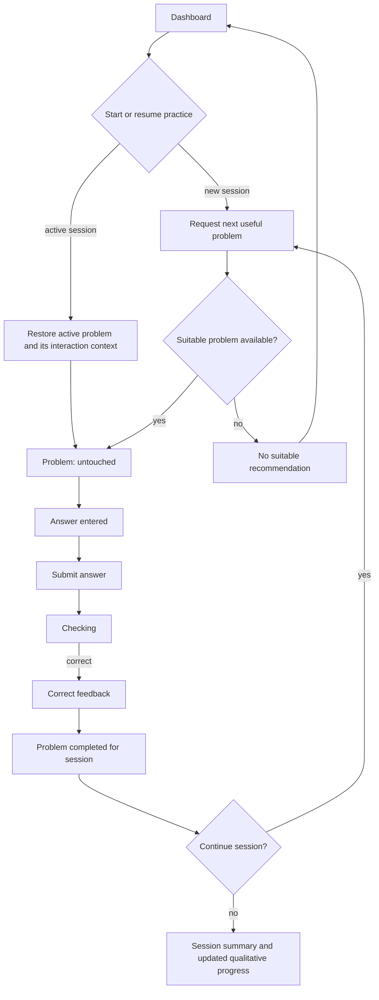
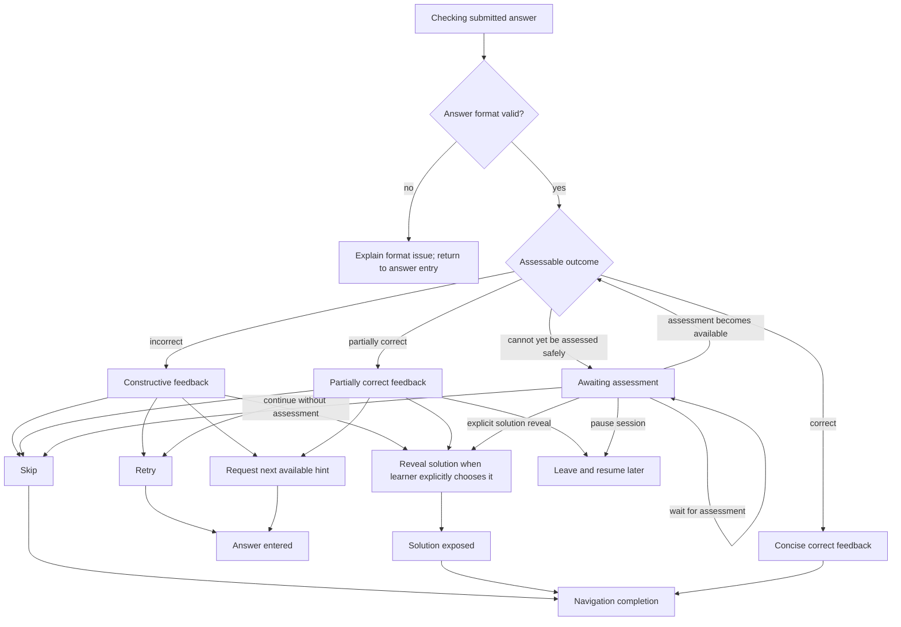

# Core Practice Flow — v0.1

## Purpose and handoff context

- **Task ID:** OT-002.1
- **Revision:** branch `docs/ot-002-user-flow`, base and inspected commit `7180be6`.
- **Goal:** define the primary MVP journey through which a student practises a problem, receives progressive support, completes or leaves the problem, and receives a qualitative progress update.
- **Scope:** student-facing interaction states, permitted transitions, learner control, and conceptual handoff of observable learning evidence.
- **Out of scope:** final UI or visual style, routes, components, database/API design, authentication, parent/admin flows, recommendation or mastery formulas, and problem-selection rules.
- **Inputs:** project vision and Learning Evidence, Mastery, Recommendation, and Review / Retention Models v0.1.
- **Status:** READY as a UX-domain proposal. It does not adopt an implementation design.

The flow implements the project vision's learning loop in interaction terms: a recommended task creates an opportunity for an independent attempt; feedback preserves retries; hints add explicit support; and the completed episode supplies traceable observations for later interpretation. The flow must never turn lack of activity, a skip, or solution exposure alone into a capability judgement.

## Evidence boundary and proposal

### Observed constraints

- The project vision requires the learner to attempt independently, retry, receive progressive hints, study a solution when needed, and continue with useful practice.
- D.1 separates raw observations from evidence interpretation. Correctness is not independence; a final answer does not establish use of every tagged capability; and abandonment alone is insufficient negative capability evidence.
- D.2 represents capability as `unknown`, `demonstrated`, or `reliable`, with separate qualitative confidence and traceable qualifiers. A practice interaction must not imply a numeric update.
- D.3 selects a problem through a semantic purpose, eligibility, and priority process. It does not prescribe a fixed sequence for the interaction flow.
- D.4 treats later same-problem work as bounded reconstruction evidence and preserves support/exposure provenance for review.

### Interpretation

A single problem episode can contain several attempts, progressively increasing support, and an eventual navigational outcome. A linear solved/failed screen would lose the difference between an incorrect independent attempt, a supported recovery, a skip, and solution-exposed reconstruction. Conversely, making each support condition a separate student journey would add interaction complexity without improving evidence quality.

### Recommended proposal

Use one controllable problem episode with explicit interaction/result states and retained context for attempts, hints, exposure, and assessment limits. Couple it to a resumable session state. The episode reports observable evidence; the existing learning models later interpret it. This is a proposed UX-domain model, not an adopted implementation architecture.

## Core flow

### Minimum complete MVP practice loop

The smallest complete loop is:

1. From the dashboard, the learner starts a new practice session or resumes a paused one.
2. The session requests a next useful problem according to the Recommendation Model's purpose and eligibility principles.
3. The learner makes an attempt, submits an answer, and receives an outcome or an explicit notice that assessment is pending.
4. After an unsuccessful or incomplete outcome, the learner can retry, request progressive help, skip, reveal a solution when appropriate, or leave the session.
5. The learner reaches a navigational completion of the problem, moves to the next useful problem or ends the session.
6. The session summary records what happened and presents qualitative, traceable progress. The learning episode is then available to the evidence and mastery models.

This is complete even when the learner skips or studies a solution: those outcomes complete navigation through the session, but they do not claim independent solution or positive mastery.

### Happy path

`Request next useful problem` is a semantic request to D.3. This flow neither ranks problems nor defines why one skill should be selected over another.

### Branching after an attempt

The diagram represents permitted paths, not required UI controls or an automatic sequence. In particular, an incorrect result never automatically opens the solution; neither does an awaiting-assessment state.

### Session start and next-problem boundary

| Situation | Flow behaviour | Boundary |
| --- | --- | --- |
| **No active session** | Starting practice creates a session context and asks for a suitable next problem. | It does not assert why the selected problem is useful; D.3 supplies the purpose and rationale. |
| **Active session is resumed** | Restore the active problem, entered but unsubmitted answer where available, attempts, hints, solution-exposure context, and completion status. | Reloading must not recreate an attempt or remove support/exposure provenance. |
| **No suitable recommendation available** | Show that no task is currently available for the requested practice context; allow return to dashboard or session completion. | It is not a learner failure and must not silently substitute a problem with an unrelated purpose. |
| **Problem reaches navigation completion** | The session may request another useful problem or the learner may end the session. | The next request is not necessarily a harder task, a new skill, or a retry of the same problem. |

## Problem states

### State model

The problem has one current **interaction state or assessed result** and retains contextual facts about assistance, attempts, prior assessed outcomes, and solution exposure. The states are not a mastery ladder: `solution-exposed` can follow an incorrect or partially correct response, while a submitted response may remain available for later assessment after the learner has navigated on.

| State | Meaning | Permitted learner control | Completion implication |
| --- | --- | --- | --- |
| **Untouched** | Problem is available; no submitted answer exists. | Enter an answer, request an appropriate first hint, skip, leave the session. | Not completed. A pre-attempt hint request is contextual evidence of support need, not a capability conclusion. |
| **Answer entered** | A draft response exists but has not been assessed. | Edit, submit, clear/change answer, request help, skip, leave. | Not completed; a draft alone is not a submitted attempt. |
| **Checking** | The submitted response is being assessed. | Wait; leave only if the assessment cannot be completed without losing the fact that it is pending. | Not completed. The submission is an observable attempt even if its result is later unavailable. |
| **Incorrect** | The answer fails the applicable requirement. The cause remains unassigned. | Retry, request the next available hint, skip, reveal a solution under the stated conditions, leave. | Not completed until the learner correctly solves, skips, or proceeds after solution exposure. |
| **Partially correct** | The response has already been assessed and valid progress or components are known, but the full answer is not accepted. | Revise/retry if meaningful, request support, skip, explicitly reveal the solution, leave. | Not completed as correct. A later correct response, explicit skip, or solution-exposed continuation can complete navigation. The assessed partial result remains partial-result evidence. |
| **Awaiting assessment** | A submitted response cannot yet be classified safely as correct, incorrect, or partially correct; for example, it may require later/manual interpretation of a proof, construction, or other response. | Wait for assessment, pause and resume later, continue without assessment by skipping, or explicitly reveal the solution. | Not an outcome and not completed as correct, incorrect, or partially correct. Continuing without assessment or after solution exposure completes navigation while retaining the unclassified submission. |
| **Correct** | The submitted response meets the applicable answer requirement. | Continue, optionally inspect a solution for comparison where offered, leave. | Completed for session navigation. A further attempt is not needed to proceed. Viewing a solution afterwards does not undo the already observed correct attempt, but it changes provenance of later work. |
| **Skipped** | The learner explicitly chooses to move on without a resolved answer. | Continue to the next task, end session, or later revisit if a future purpose makes it appropriate. | Completed for session navigation; not positive or negative capability evidence by itself. |
| **Solution-exposed** | The full solution has been viewed. Any immediate reproduction has solution-exposed provenance. | Read/reconstruct, make a further response for learning, continue, leave. | The learner may proceed, so it is completed for session navigation. It is not an independently solved problem. |

### Hints and support

Hints are progressive semantic support, not automatic penalties. The available sequence is `focus`, `strategy`, then `next-step`; the meaning of each hint depends on what the learner had already produced.

| Support point | Purpose | What remains available | Evidence boundary |
| --- | --- | --- | --- |
| **Focus hint** | Direct attention to a condition, object, relation, or overlooked part of the problem. | Retry, edit, ask for a later hint, skip, leave; solution may be explicitly requested if its conditions are met. | A later success may be lightly or materially supported depending on the hint's actual contribution. |
| **Strategy hint** | Offer or confirm a reusable approach when the learner cannot select a direction. | Retry, ask for next-step support, skip, leave, or explicitly request solution when appropriate. | A correct answer can show execution with support; it does not by itself show independent strategy selection. |
| **Next-step hint** | Unblock a local bridge after a direction is known. | Retry, skip, leave, or explicitly request solution. | It may be light confirmation or material support; the label alone does not settle independence. |
| **All progressive hints used** | No further partial support is available in this episode. | Retry/reconstruct independently from the support already given, skip, reveal solution, or leave. | Do not reveal the solution automatically and do not treat exhaustion of hints as failure. |

### Incorrect answers, partial answers, and solution reveal

Feedback after an incorrect answer should identify what can safely be said about the response and invite a next action. It should be constructive and bounded: an invalid final value may be noted, but the feedback must not disclose a full path or turn an unobservable cause into a skill diagnosis.

Full solution becomes available only by the learner's explicit choice when continued independent work is no longer the purpose of the episode. It is normally appropriate after at least one meaningful attempt, after progressive support has been used, or when the learner chooses to stop and learn from the worked solution. A learner who has not attempted may skip or leave; a product may permit an explicit solution choice with clear acknowledgement that it changes the evidence context. No fixed retry count or hint threshold is required.

While awaiting assessment, the learner may wait, pause and resume, continue without assessment, or explicitly reveal the solution. A solution is never revealed automatically. Revealing it ends the waiting interaction and permits navigation; it does not erase the pre-exposure submission, which may still be assessed later where its original work is available. Any response or reproduction after exposure cannot establish an independent outcome for that original episode.

After solution exposure, the learner may reproduce steps, ask questions supported by the problem context, or continue to the next task. Immediate reproduction is useful engagement or reconstruction, but it is not an independent success on the original problem. A later same-problem revisit may be useful for reconstruction; it remains weaker evidence of broad reuse than independent variation or transfer.

### When a problem is completed

A problem is **completed for session navigation** when one of these outcomes is recorded:

- a correct result is established;
- the learner explicitly skips it; or
- the learner has viewed the solution and explicitly continues.

Awaiting assessment is not silently converted into an assessed outcome. If it cannot be resolved within the session, the learner may pause, explicitly continue without assessment, or explicitly reveal the solution; the submission remains unclassified rather than being recast as correct, incorrect, or partially correct. This definition prevents trapping the learner while preserving the difference between navigational completion and learning outcome.

`Correct` describes an assessed response, not its independence. The retained attempt, hint, retry, and solution-exposure context lets D.1 distinguish independent success, supported success, and solution-exposed reconstruction. None of those evidence interpretations is the same as navigational completion.

## Session states

| Session state | Meaning and transition | Learner control |
| --- | --- | --- |
| **No active session** | The dashboard has no resumable episode. Starting practice moves to request-next. | Start practice. |
| **Requesting next problem** | The session asks the Recommendation Model for a problem appropriate to its stated purpose and current evidence. | Pause the session or explicitly finish it before a problem is opened. |
| **Active problem** | A problem is in one of its interaction states and retains its episode context. | Attempt, ask for permitted help, skip, reveal solution under conditions, leave. |
| **Awaiting assessment** | A submitted response cannot yet be assessed safely. The active problem retains the response and its assessment limit. | Wait, pause and resume, continue without assessment, or explicitly reveal the solution. |
| **Paused session** | The learner leaves while the active session remains resumable. | Resume the same contextual episode or explicitly finish the session. Leaving is not abandonment-derived negative evidence. |
| **No recommendation available** | No appropriate next problem is available for the session request. | Return to dashboard, end the session, or resume later when context changes. |
| **Session summary** | The learner has chosen to end a session or no further suitable problem is offered. The recorded episodes can inform qualitative progress. | Review the summary, return to dashboard, start later practice, or resume a paused session. |

Leaving an active problem without explicitly finishing the session moves to **Paused session**. Explicitly finishing the session moves to **Session summary**; it does not use "exit" as a second name for pausing. Session completion is an explicit end of the learner's active practice period, or a natural endpoint when no suitable next problem is available. It is not a claim that every opened problem was solved, every capability was assessed, or a fixed number of tasks was reached.

### Progress shown at session completion

The summary should show a truthful account of the session, such as:

- which problems reached correct, partially correct, skipped, solution-exposed, or awaiting-assessment states;
- whether attempts were independent, supported, or solution-exposed where that provenance is observable;
- hints and retries as context for the learner's work, without treating a hint as an automatic penalty;
- qualitative evidence changes or unresolved questions where interpretation supports them, for example a demonstrated capability needing more independent variation; and
- the stated purposes served during the session, such as exploration, strengthening, transfer, reconfirmation, or challenge, when available from D.3.

It must not manufacture mastery percentages, claim that unattempted capabilities are weak, equate completion count with mastery, or expose a numeric progress formula unsupported by the domain models.

## Edge cases

| Situation | Required behaviour | Must not infer |
| --- | --- | --- |
| **Repeated incorrect attempts** | Preserve each attempt and its support context. Continue to offer retry, next progressive help, skip, solution exposure under the learner's explicit choice, and leaving the session. Feedback should avoid escalating into a punishment loop. | That a particular skill is absent, or that the same problem must be immediately repeated indefinitely. |
| **All hints used** | Leave retry, skip, explicit solution reveal, and the choice to pause or finish the session available. | That the learner failed, or that a solution should open automatically. |
| **Invalid answer format** | Explain the assessable format and return to answer entry before correctness is evaluated. | A learning failure or incorrect skill attempt merely from a formatting issue. |
| **Problem cannot be evaluated automatically** | Move to **Awaiting assessment**; do not label the response partially correct unless valid partial progress has already been assessed. Permit waiting, pausing and resuming, continuing without assessment, or an explicit solution reveal. | Correctness, incorrectness, partial correctness, or capability evidence beyond what is visibly attributable. |
| **Reload or resume** | Restore the active session and problem context, including attempts, hints, response state, and solution exposure. If an assessment was pending, preserve that status rather than resubmitting. | A new first attempt, renewed independence, or missing support. |
| **Recommendation unavailable** | End or pause the practice request transparently; retain the completed session history. | Learner weakness, completed mastery, or a need to select an arbitrary substitute. |
| **Opened problem becomes unavailable** | Preserve the episode to the point of unavailability, explain that it cannot continue, and allow return/end. Request a different task only through the normal next-problem boundary. | A skip, incorrect attempt, or completed learning result solely from unavailability. |
| **Learner pauses or finishes mid-session** | Pause the session when possible and permit resumption with provenance intact; allow explicit completion through the session summary as well. | Negative capability evidence from abandonment alone. Visible submitted work remains separately interpretable. |
| **Same problem appears later for review** | Label its review/reconstruction context conceptually and retain prior attempts, feedback, hints, and solution exposure. | A fresh independent replication or meaningful transfer merely because time passed. |

## Evidence handoff

The flow produces observations for D.1; it does not calculate mastery or decide recommendation priority. Each handoff retains provenance so D.2–D.4 can distinguish outcome, support, attribution, transfer, freshness, and unresolved ambiguity.

| Important transition | Conceptual observable evidence | Later interpretation boundary |
| --- | --- | --- |
| **Start or resume → problem** | Practice-session context and D.3 recommendation purpose/rationale for the opened problem. | Selection purpose does not prove performance or mastery. |
| **Answer entered → submit** | Submitted attempt, response content/form, problem context, and prior support/exposure state. | A submission does not attribute a result to every tagged capability. |
| **Invalid format → edit** | Response-format validation issue. | Not an incorrect capability observation. |
| **Checking → incorrect** | Incorrect attempt observation, including visible work where available and prior help. | The cause may be execution, interpretation, strategy, or another component; incorrect is not automatic skill failure. |
| **Checking → partially correct** | Assessed valid progress or components of a response that is not fully accepted. | May supply bounded partial-result evidence; it is not full correctness or independent mastery. |
| **Checking → awaiting assessment** | Submitted response cannot yet be classified safely, with its original work and assessment limit retained. | Not correct, incorrect, or partially correct; no capability conclusion follows automatically. |
| **Checking → correct** | Correct response with first-attempt/retry history, assistance, solution exposure, problem context, and credible attribution. | Correctness alone does not establish independence, transfer, or mastery of all tags. |
| **Request a hint** | Hint level, timing, learner work before it, and later work after it. | Hint use does not mechanically determine independence or become a penalty. |
| **Reveal solution** | Full-solution exposure and its timing relative to attempts or awaiting-assessment state. | Immediate reproduction is not independent success. A pre-exposure submitted response remains separately assessable where possible; later work is solution-exposed. Exposure alone is not negative capability evidence. |
| **Skip, pause, or finish session** | Explicit skip, paused-session departure, or explicit session completion, plus any separately visible prior work. | Skip/abandonment alone is insufficient negative capability evidence. |
| **Complete → next problem** | Episode closure outcome and the next request's purpose. | The flow does not decide what task is next or treat a same-problem retry as transfer. |
| **End session → session summary and progress** | A bounded set of episodes and their outcomes, support, exposure, and unresolved interpretation. | The summary must not convert sparse evidence into numeric mastery or certainty. |
| **Later same-problem review** | Retry/reconstruction provenance linked to prior feedback and solution exposure. | It may inform recall or reconstruction, but does not normally establish broad reliable reasoning. |

## Answers to the task questions

1. **What is the minimum complete MVP practice loop?** Start or resume a session, receive an eligible useful problem, attempt and assess it, preserve retry/help/skip/solution choices, reach a navigational completion, then request another task or show a truthful summary.
2. **When is a problem considered completed?** For navigation, after a correct result, explicit skip, or explicit continuation following solution exposure. This is separate from independently solving it.
3. **Can skipped or solution-exposed problems count as completed for session navigation?** Yes. They can end the current problem without being recorded as independent success or capability failure.
4. **When should full solution become available?** Through an explicit learner choice when continued independent work no longer serves the episode, normally after an attempt or progressive support. It never appears automatically after an error; a no-attempt reveal needs clear acknowledgement of its evidence consequences.
5. **What happens after all hints are exhausted?** The learner may retry/reconstruct, skip, explicitly reveal the solution, or leave. No automatic solution or failure state follows.
6. **How does reload/resume work conceptually?** It restores the same episode and all its provenance rather than starting a fresh attempt. Awaiting assessment remains awaiting assessment.
7. **What progress should the session summary show?** Traceable qualitative outcomes, support/exposure context, and evidenced progress or open uncertainty; not mastery percentages, a universal score, or unsupported weakness labels.
8. **Which states must OT-002.2 handle next?** At minimum: dashboard/no active session, requesting or unavailable recommendation, active problem states from untouched through checking and all assessed or unassessed outcomes, progressive hint levels, paused/resumable sessions, awaiting assessment, solution exposure, session summary, and the transition from episode evidence to qualitative progress display.

## Alternatives considered

### Linear solve-or-fail flow

A linear flow would show one answer outcome and move directly to the next problem. It is simple, but it cannot support the project vision's retry, progressive-hint, and solution-learning loop. It also loses essential evidence about support and exposure.

### Separate flows for independent, supported, and reviewed work

This would make provenance explicit, but it would duplicate the student journey and force the learner to classify their work before the evidence is interpreted. The same problem episode can contain an independent attempt, support, and later reconstruction.

### Recommended: one controllable episode with retained context

Use one problem and session state model. Keep interaction outcome separate from contextual facts such as hints, retries, review purpose, and solution exposure. This is the smallest flow that preserves learner control and the evidence distinctions required by D.1–D.4 without defining storage or UI structure.

## Open questions and validation gaps

- Which answer types can receive useful bounded feedback before assessment is available requires the later content and assessment design; this flow only prohibits false binary outcomes.
- The exact learner-facing wording and accessibility behaviour for hints, invalid formats, awaiting assessment, and unavailable recommendations belong to later UX work.
- The product still needs validation of when a learner perceives a solution as appropriate and whether the explicit acknowledgement for a pre-attempt reveal is sufficient to protect independent practice.
- Session duration, stopping defaults, and presentation of qualitative progress need user-flow and usability validation. This document intentionally defines no schedule or target count.
- OT-002.2 should refine the listed states into interaction requirements, including loading/error/empty behaviour, without changing the learning-evidence boundaries established here.

## Self-review and completion

| Risk | Check in this proposal |
| --- | --- |
| Final UI or implementation design leaks in | States and conceptual actions only; no screens, components, routes, API, or storage design. |
| Solution is revealed automatically | Explicitly prohibited after incorrect answers and after exhausted hints. |
| Skip becomes failure | Skip and abandonment are retained as context, not negative capability evidence alone. |
| Hints erase positive work or mechanically penalise | Hint timing and actual contribution remain contextual; supported success is preserved. |
| Completion is confused with mastery | Navigational completion is explicitly separate from independent success and capability conclusion. |
| Recommendation logic leaks in | The flow requests the next useful problem but does not filter, rank, or schedule it. |
| Reload fabricates evidence | Resume restores provenance and pending status. |
| Same-problem review proves transfer | Explicitly bounded as reconstruction/recall evidence. |

Validation: required source models were inspected; the flow, state models, edge-case table, evidence-handoff table, and task-question answers are present. This document is the only intended change. `git diff --check` remains required after drafting.

**READY** — reviewable UX-domain proposal; not an implementation authorization.
