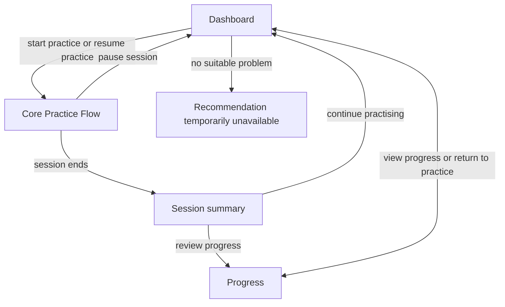

# Dashboard and Progress Flow — v0.1

## Purpose and handoff context

- **Task ID:** OT-002.2
- **Revision:** branch `docs/ot-002-user-flow`, inspected commit `b4a054a`.
- **Goal:** define the student Dashboard and Progress flow around the core practice session.
- **Scope:** learner-facing information purpose, states, conceptual navigation, session-summary handoff, and honest qualitative progress language.
- **Out of scope:** final UI, components, routes, database/API design, charts, percentages, badges, points, gamification, recommendation formulas, and mastery formulas.
- **Inputs:** project vision, Core Practice Flow v0.1, and Mastery, Recommendation, and Review / Retention Models v0.1.
- **Status:** READY as a UX-domain proposal. It does not adopt an implementation design.

## Evidence boundary and proposal

### Observed constraints

- The project vision requires a student to receive useful progress after a complete practice session, while retaining independent attempts, retries, progressive hints, solution study, and later related work.
- The Core Practice Flow distinguishes navigational completion from a correct response, independence, and mastery. It returns a qualitative session record, including correct, partially correct, skipped, solution-exposed, and awaiting-assessment outcomes.
- The Mastery Model describes a system belief as `unknown`, `demonstrated`, or `reliable`, with separate qualitative confidence, scope, traceable evidence, and diagnostic or temporal qualifiers. `Unknown` is not weakness.
- The Recommendation Model provides a purpose and a reason why a selected problem is useful. It does not establish capability or require a numeric priority shown to the learner.
- The Review / Retention Model permits reconfirmation because evidence has a justified current gap or contradiction; time alone does not imply forgetting or lower mastery.

### Interpretation

The Dashboard answers the immediate question, “What can I do now?” It should not ask the learner to interpret a broad capability history before practising. Progress answers the separate question, “What has my work shown so far?” It should not pretend that sparse evidence is a score or label unattempted work as a deficit.

### Recommended proposal

Use an **action-first Dashboard** with one primary practice action and a concise, evidence-grounded reason. Link it to a **Progress view** that groups capability evidence into clear learner-facing meanings, while retaining the underlying `unknown`, `demonstrated`, and `reliable` semantics. A session summary is the handoff between a completed practice episode and the next dashboard/progress view.

## Dashboard

### Minimum useful dashboard

The Dashboard should answer five questions without becoming a full history report:

1. **What should I do now?** Offer one primary action: start a useful practice session, resume the current session, or return to an active problem.
2. **Why is it useful?** State the selected practice purpose in plain language, such as trying a new area, practising a recently used idea independently, checking use in a new context, or trying an idea again in a fresh problem.
3. **What did I recently complete?** Show a short factual account of recent session outcomes, with their support/exposure context where it affects meaning.
4. **Is there unfinished work?** Make an active or paused session visible and give it precedence over a new practice request.
5. **What currently needs attention?** Surface a small number of evidence-grounded open needs: independent practice after support, a need for broader use in another context, an attributable difficulty signal, or reconfirmation relevant to current work.

The Dashboard does not claim that its primary action is the globally best problem. It is an invitation to a useful next practice opportunity according to D.3.

### Primary action

The primary Dashboard action is:

- **Resume practice** when the learner has a paused session;
- **Return to the current problem** when a session remains in progress; otherwise
- **Start practice** when a suitable problem is available.

This is one action for the learner's current situation, not multiple competing calls to action. It opens or returns to the Core Practice Flow. A reason accompanies the action, but the Dashboard does not expose ranking, candidate comparison, or recommendation score.

### Dashboard states

These are conceptual conditions, not implementation enums. More than one can describe the learner's history, but the active-session condition takes precedence for the primary action.

| Dashboard condition | What the learner needs to understand | Primary action and explanation | What must not be implied |
| --- | --- | --- | --- |
| **First visit** | No session or progress evidence exists yet. | **Start practice**: begin with a bounded problem so the system can learn what evidence is available. | That unobserved capabilities are weak, or that the first task is a diagnostic verdict. |
| **Ready to practise** | No unfinished session blocks a new task; a suitable practice purpose and problem are available. | **Start practice** with a brief reason tied to the purpose and missing evidence. | That the learner has a single weakest skill or that the task is necessarily harder. |
| **Session in progress** | A current problem remains open in the active session. | **Return to the current problem** and retain its attempts, hints, assessment state, and solution-exposure context. | That returning creates a new attempt or restores independence. |
| **Session paused** | Work was left resumable, rather than completed. | **Resume practice**, with the current problem or awaiting-assessment context preserved. | That leaving was failure, abandonment evidence, or session completion. |
| **Session completed** | The learner has just ended a session and has a bounded record of what happened. | **View the session summary**, then offer the current appropriate action when the learner returns to Dashboard. | That every opened problem was solved or that a session count establishes mastery. |
| **Recommendation temporarily unavailable** | There is no suitable problem for the requested practice context at present. | Explain that no appropriate task is available; allow viewing Progress, pausing the request, or finishing it. | Learner weakness, lack of progress, or permission to substitute an unrelated problem. |
| **A fresh check would help** | A previously supported capability has a current temporal/context gap, relevant contradiction, or dependency need. | **Start practice** with wording such as “Try this idea again in a fresh problem,” and state why that practice is useful now. | That the learner has forgotten or lost an established capability because time passed. |

### Recent work and current attention

Recent work should be factual and compact: a recently completed session, a correct response with or without meaningful support, a skipped problem, a viewed solution, or a response awaiting assessment. It should retain enough context to avoid presenting a solution-exposed reproduction as an independent solve.

“Needs attention” is an evidence question, not a negative label. Appropriate learner-facing reasons include:

- **Try it without help:** earlier work was completed with material support, so independent use is still unobserved.
- **Use it in a new problem:** evidence is limited to the same context and broader reuse is not yet shown.
- **Check what changed:** comparable recent work created an attributable difficulty signal or current uncertainty.
- **Try it again in a fresh problem:** a current use matters but earlier work has not been checked in a relevant context.

The Dashboard should show only reasons that are traceable to evidence and relevant to current practice. It must not turn every tag, old attempt, or uncertain attribution into a learner-facing alert.

## Progress

### Progress purpose and content model

Progress provides an honest overview of what the learner's completed work currently supports. It is not a scorecard, prediction, curriculum map, or proof that a capability is permanently present or absent.

| Progress condition | Meaning | What the learner can understand |
| --- | --- | --- |
| **No progress evidence yet** | No usable capability conclusion is available, or existing work remains unassessed/unattributable. | “Not explored yet” and a neutral account of what is missing. This condition is not weakness. |
| **Progress available** | At least one capability has an evidence-grounded conclusion, confidence, scope, or relevant qualifier. | What current work supports, what remains uncertain, and which recent evidence changed the picture. |

| Progress grouping | Underlying learning-model meaning | Learner-facing interpretation | Useful context |
| --- | --- | --- | --- |
| **Not explored yet** | `Unknown`: no usable evidence, or no conclusion is warranted. | “We have not seen enough work in this area yet.” | Whether there are no attempts, only unassessable work, or an attribution limit. It is never a weak-area label. |
| **Starting to use it** | `Demonstrated` with limited confidence or narrow scope. | “You have used this idea in one kind of problem; more examples can show how it works in others.” | Independence/support, transfer context, and whether evidence is recent enough for the current claim. |
| **Getting more confident** | `Demonstrated` with supported or stronger confidence in its stated scope. | “You have used this idea in the problems seen so far. Next, it may be useful to try it with less help or in a different problem.” | Scope, independent versus supported use, transfer breadth, and unresolved diagnostic qualifier. |
| **Working well** | `Reliable` with its stated scope and confidence. | “You have used this idea successfully in the problems we have seen.” | Evidence basis, meaningful independent variation for reasoning, and any current reconfirmation rationale. |
| **Needs another look** | An attributable diagnostic qualifier, unresolved contradiction, or justified reconfirmation need attached to a conclusion. | “More work would clarify this area.” | The named observed obstacle or reason for reconfirmation. It can coexist with demonstrated or reliable evidence. |

The grouping is qualitative. It may use the Mastery Model's confidence meanings—unavailable, limited, supported, and strong—only as plain-language evidence sufficiency, never as a percentage, point total, or hidden numerical threshold.

### Capability overview

The capability overview may show, for each visible capability:

- its current qualitative grouping and stated scope;
- what recent work supports that interpretation;
- whether the relevant work was independent, supported, or solution-exposed;
- whether use was confined to one known problem or observed in meaningful variation;
- a current diagnostic or temporal qualifier, explained as an open question rather than a permanent trait; and
- whether no usable evidence exists yet.

It must preserve a distinction between **no evidence**, **limited evidence**, and **evidence suggesting a current difficulty**. A learner who has never attempted systematic enumeration belongs in “Not explored yet,” not “Needs another look.”

### Recent progress and change

Progress should describe change by comparing traceable evidence, not by calculating gains. Useful changes include:

- first observed, attributable use of a capability;
- a correct independent response after previously supported work;
- new meaningful variation after same-context success;
- a later attributable response that confirms current use;
- an assessed partial result that narrows what is understood; and
- contradictory recent evidence that makes the current conclusion less certain while preserving the historical basis.

The explanation should say what changed and what remains unestablished. For example, “You used this approach independently in a different setting” is informative; “mastery increased” without evidence context is not.

### What Progress should not show directly

Some information is useful for interpretation but not useful as a direct learner-facing claim:

- raw observations, internal attribution-confidence judgements, and competing diagnostic hypotheses that have not been resolved;
- numeric scores, weights, rankings, mastery percentages, predicted success, or “weakest skill” labels;
- every capability tag on a multi-skill problem, because a tag does not prove use;
- a method exposure record as method mastery;
- a claim that time caused forgetting; and
- candidate problems rejected by the Recommendation Model or its internal priority reasoning.

The product may translate an evidence-backed reason into clear learner language. It must retain the underlying traceability so that a plain statement does not become an unsupported conclusion.

## Session summary

### Purpose

The session summary closes the Core Practice Flow and explains the just-completed learning episode before the learner returns to Dashboard or opens Progress. It is a truthful account of observed work, not a report card.

### Summary model

| Summary subject | What may be shown | Required distinction |
| --- | --- | --- |
| **What happened in the session** | Problems that were correct, partially correct, skipped, solution-exposed, or awaiting assessment when the session ended. | Navigation completion is not a solved label. A pending response remains unclassified. |
| **How a correct result was reached** | “Solved without meaningful help” where the episode supports independent work; “completed after help” where support materially shaped the path; or a qualified account where the support boundary is uncertain. | A correct answer after a hint is positive evidence, but does not show independent strategy selection automatically. |
| **Solution study and skips** | “Reviewed a solution” and “moved on without a resolved answer,” with any visible prior work retained in the record. | Neither is independent success or capability failure by itself. |
| **What the work changed** | Plain-language evidence change, such as first evidence, supported use, independent use in a new context, or an open question after comparable difficulty. | Do not claim a numeric mastery gain, mastery loss, or a universal trait. |
| **What may need work next** | A bounded, evidence-grounded reason: independent use, meaningful variation, clarification of an attributable obstacle, or reconfirmation relevant to a current claim. | It is an open learning purpose, not a command to repeat the same problem or a recommendation rule. |

If assessment is still pending, the summary says that the response is awaiting assessment and does not describe it as correct, incorrect, or partially correct. If the learner viewed a solution after submitting an unassessed response, the summary preserves the earlier submission context and labels later reconstruction as solution-exposed.

## Navigation

The Dashboard delegates problem selection to D.3 when it starts or resumes practice. The Core Practice Flow owns problem interaction and session completion. Progress explains accumulated evidence; it does not select the next task. A paused session remains resumable when the learner returns from Dashboard or Progress.

## Edge cases

| Situation | Required behaviour | Must not imply |
| --- | --- | --- |
| **First-time learner** | Offer the first bounded practice opportunity and explain that its purpose is to begin gathering useful evidence. | Existing weakness, a blank progress score, or a required diagnosis. |
| **No progress evidence yet** | Show “Not explored yet” or an equivalent neutral explanation; distinguish no evidence from unassessable/pending work. | A negative capability conclusion. |
| **Paused session with old dashboard information** | Give resume precedence and restore the active problem's context before offering a new practice action. | A fresh first attempt, a discarded hint/solution history, or a completed session. |
| **Session completed with assessment pending** | State that the response is awaiting assessment and preserve it in recent work; show only conclusions supported by already assessed evidence. | That the problem was solved, failed, or partially correct. |
| **Solution viewed after a submitted response** | Show solution study separately from the earlier submission. | That later reproduction is independent; where possible, retain the original submission for later assessment. |
| **No suitable recommendation** | Explain the temporary absence of an appropriate task; allow viewing Progress, pausing the request, or finishing it. | Learner weakness or a need to serve an unrelated task. |
| **Stale reliable evidence** | Explain a reconfirmation purpose only when a present use or justified gap makes it relevant. | Forgetting, automatic mastery decay, or that reliable evidence has been erased. |
| **Recent contradictory evidence** | Preserve earlier evidence and describe the current uncertainty or named observable obstacle carefully. | That a past reliable conclusion was false or that a single error defines the learner. |
| **Multi-skill problem history** | Present only capability conclusions with credible attribution. | That every tagged capability was used or changed. |

## Alternatives considered

### Dashboard as a complete progress report

This would show all capabilities, history, and evidence detail before practice. It provides context, but makes the immediate action unclear and invites unsupported comparison of sparse evidence. It is not sufficient for the MVP's action-first learning loop.

### Separate Dashboard modes for exploration, remediation, review, and challenge

This would make recommendation purposes visible as product modes. It risks treating the learner as responsible for selecting a purpose before understanding their evidence and duplicates D.3's domain boundary.

### Recommended: action-first Dashboard with separate Progress

The Dashboard gives one appropriate action and a concise reason. Progress supplies the broader evidence overview when the learner asks for it. This is the smallest model that supports orientation, explanation, resumption, and honest evidence communication without a score, scheduler, or visual system.

## Answers to the task questions

1. **What is the dashboard's primary action?** Resume an unfinished session when one exists; otherwise start the next useful practice session. A currently open active problem uses “Return to the current problem.”
2. **What information belongs on Dashboard versus Progress?** Dashboard contains the immediate action, its reason, unfinished work, concise recent outcomes, and a small number of current attention reasons. Progress contains the capability overview, qualitative evidence sufficiency, scope, traceable recent changes, and unresolved evidence questions.
3. **How should `unknown` appear without looking negative?** As “Not explored yet” with an explanation that there is not enough usable evidence. It must be visibly distinct from an attributable difficulty signal.
4. **How should supported success differ from independent success in summaries?** Describe the observed support: independently solved only where the episode supports it; otherwise completed after help or with a qualified support boundary. Both can be positive evidence, but they support different conclusions.
5. **What should a first-time learner see?** One bounded practice action and a neutral explanation that the first work helps establish what evidence is available; no weak labels, empty score, or assumed diagnosis.
6. **What should happen when no next problem is available?** State that no appropriate task is temporarily available, retain prior progress, and allow viewing Progress, pausing the request, or finishing it. Do not substitute an unrelated problem.
7. **What information is useful but should remain hidden from the learner?** Scores, formulas, rankings, raw attribution judgements, unresolved competing diagnoses, method-exposure-as-mastery claims, all multi-skill tags, and recommendation candidate comparisons.
8. **What must OT-002.3 cover next?** The detailed learner-facing requirements for the practice session, including how the Dashboard action/reason, progress wording, session summary, loading/error/empty conditions, and accessibility behave without changing this evidence model or designing final visual components.

## Open questions and validation gaps

- Learner research is needed to validate which plain-language descriptions of independence, support, and uncertainty are clear to grades 5–6 without being discouraging.
- The acceptable amount of recent-work detail on Dashboard, and which evidence gaps deserve visible attention, remain product decisions requiring usability evidence.
- Later content and assessment work must define when partial or manual assessment becomes available; this flow only preserves the honest pending state.
- The relationship between a no-recommendation condition and future content availability is outside this UX-domain model.
- OT-002.3 must not turn Dashboard reasons into fixed schedules, recommendation scores, or mastery formulas.

## Self-review and completion

| Risk | Check in this proposal |
| --- | --- |
| Unknown appears weak | “Not explored yet” is separate from diagnostic difficulty and explains lack of usable evidence. |
| Dashboard repeats D.3 | It receives one purpose and learner-relevant reason but does not filter, rank, or select problems. |
| Completion becomes mastery | Summary and Dashboard distinguish navigation, correctness, independence, support, and capability evidence. |
| Time implies forgetting | Reconfirmation uses a justified current reason and preserves reliable evidence. |
| Evidence jargon leaks directly | Learner-facing language is paired with the underlying domain boundary where needed. |
| UI or gamification leaks in | No components, routes, charts, points, badges, scores, or visual treatment is specified. |

Validation: source documents and Core Practice Flow were inspected; required Dashboard/Progress states, session summary, navigation, edge cases, alternatives, and explicit answers are present. This is the only intended document change. Run `git diff --check` before acceptance.

**READY** — reviewable UX-domain proposal, not an implementation authorization.
