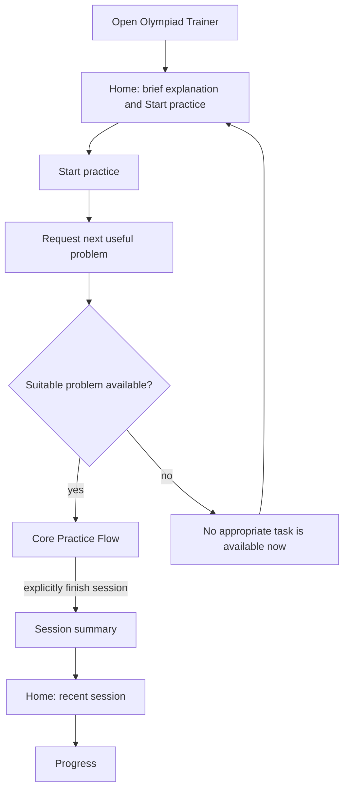
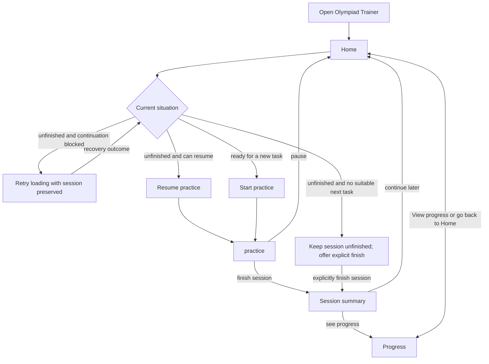

# First Visit and Student Navigation Flow — v0.1

## Purpose and handoff context

- **Task ID:** OT-002.3
- **Revision:** branch `docs/ot-002-user-flow`, inspected commit `c4a24d2`.
- **Goal:** define the first-visit and top-level student navigation flow for the Olympiad Trainer MVP.
- **Scope:** minimum entry into first practice, returning-learner paths, top-level destinations, empty states, and continuity with the Core Practice and Dashboard / Progress flows.
- **Out of scope:** final UI, visual style, components, routes, database/API design, detailed authentication, parent/admin flows, and gamification.
- **Inputs:** project vision, Core Practice Flow v0.1, and Dashboard and Progress Flow v0.1.
- **Status:** READY as a UX-domain proposal. It does not adopt an implementation design.

## Evidence boundary and proposal

### Observed constraints

- The MVP serves grade 5–6 mathematics olympiad preparation and must demonstrate a complete useful practice session, rather than a broad profile or onboarding system.
- The Core Practice Flow starts or resumes a session, preserves attempt and help context, ends in a session summary, and never equates navigation completion with solving or mastery.
- The Dashboard and Progress Flow assigns one immediate action to Dashboard, keeps Progress as the broader history/evidence view, and gives unfinished practice precedence over a new task.
- A first visit has no learning history or capability evidence. This is an empty state, not a learner deficit.
- A next useful problem is requested through the established recommendation boundary. Navigation must not invent a fallback problem when none is suitable.

### Interpretation

Before the first problem, the learner needs only to understand the activity and begin it. Asking for grade, subject, or preparation goal is justified only if the answer changes the available practice experience. In the current MVP scope, mathematics, the intended age range, and olympiad preparation are already the product context; no separate choice is established as necessary.

Adding a permanent Practice destination duplicates the Dashboard's action and creates a second place to decide how to begin. The Practice flow is instead an intentional, temporary context entered from Home and returned from when a session pauses or ends.

### Recommended proposal

Use two top-level learner destinations:

- **Home**: the current action, its plain-language reason, current session continuity, and concise recent result.
- **Progress**: the learner's broader qualitative history and open learning questions.

**Practice** is not a third permanent destination. It is the Core Practice Flow opened by Home's **Start practice** or **Resume practice** action. This preserves one clear start point while keeping unfinished work immediately recoverable.

## First visit

### Minimum onboarding

No mandatory profile or onboarding questionnaire is needed before the first useful problem. Home shows a short, plain explanation alongside the immediately available **Start practice** action: the learner will try olympiad-style mathematics problems independently, can ask for hints, and can learn from a solution when needed. The explanation is informational only. It requires no acknowledgement, confirmation, carousel completion, modal completion, or extra step before starting practice.

Do not request these on first visit unless a later, adopted capability makes the answer change available practice:

- **Grade:** the MVP already serves grades 5–6; do not ask merely to display it or infer ability.
- **Subject:** mathematics is the first MVP subject; there is no current subject choice.
- **Preparation goal:** do not ask the learner to select remediation, review, transfer, challenge, or an internal recommendation purpose.
- **Learning history, weak areas, or confidence:** none can be reliably supplied before practice and the product should not ask the learner to self-diagnose.

If a future content set genuinely changes by grade, subject, or stated goal, the relevant choice must be introduced only at the point where it changes the learner's experience. This document defines no such setup step.

### First-visit happy path

The first task begins a practice opportunity; it does not label the learner, establish an ability level, or create an obligation to finish a prescribed onboarding sequence. The learner can start directly from Home without completing or dismissing the explanation.

### First-session empty states

| Situation | What the learner should understand | Available action | Must not imply |
| --- | --- | --- | --- |
| **No learning history** | This is the first practice opportunity. | **Start practice**. | An empty score, missing profile, or weak area. |
| **No progress yet** | Nothing has been established yet because there has not been enough usable work. | **Start practice** when a task is available; otherwise remain on understandable Home. | Zero progress, failure, or a need to choose a skill. |
| **No unfinished practice** | There is no unfinished work to resume. | **Start practice** when available. | That the learner must resume, review, or finish something first. |
| **No appropriate task available** | A suitable task is temporarily unavailable. | View Progress if useful, pause or finish the request, or return later. | An application error, learner weakness, or an unrelated substitute task. |

For a first-time learner, Progress must not present empty analytics. If opened, it should use the existing neutral wording, such as “Not explored yet,” and explain that practice will gradually provide a clearer picture.

## Returning learner

### Returning-learner flow

The names describe what the learner will get:

- **Resume practice** (`Продолжить тренировку`) restores unfinished Practice when it can actually resume, including the current problem and its context, without creating a new attempt. A blocking technical failure instead uses primary `Попробовать снова`; a known unavailable next task uses primary `Завершить тренировку`, with Progress secondary.
- **Start practice** asks for a new useful problem only when no unfinished Practice takes precedence.
- **Finish session** leads to the Session summary; it is distinct from pausing.
- **Progress** shows history; returning to **Home** restores the current action rather than selecting a problem itself.

### Finishing or leaving a session

Leaving active work without explicitly finishing the session returns the learner to Home with a resumable session. Explicitly finishing a session leads to its summary, then to Home or Progress. A learner may also leave from the summary; their completed session remains part of recent work, without requiring an immediate next task.

No top-level action means “abandon,” “fail,” or “reset progress.” The Core Practice Flow remains the authority for whether a problem was correct, skipped, solution-exposed, or awaiting assessment.

## Navigation

### Top-level navigation model

The smallest understandable MVP navigation is:

| Destination or context | Student need | How it is reached | Boundary |
| --- | --- | --- | --- |
| **Home** | Know what to do now and whether work is unfinished. | First visit, later visits, returning from Progress, pausing practice, or after a session summary. | It does not replace the problem interaction or show full history. |
| **Practice** | Work on the active or newly selected problem. | Home's start/resume action. | It is a temporary task context, not a permanent top-level destination or a second recommendation system. |
| **Progress** | Understand what recent work has shown and what may need more practice. | Home or session summary. | It does not choose the next problem or turn unknown into a weak label. |
| **Session summary** | Understand the just-ended session before deciding what to do next. | Explicitly finishing a Core Practice session. | It is an outcome handoff, not a permanent navigation destination. |

`Home` is preferable to `Today` for the MVP because the action may be resuming unfinished practice or viewing a temporarily unavailable recommendation, not a daily schedule. `Progress` is clear as a history-oriented destination. `Practice` is clear in context but does not need permanent top-level placement because Home already exposes its only MVP entry actions.

### Is a separate Practice destination necessary?

No. The Dashboard / Home action already starts or resumes practice based on the learner's current situation. A separate permanent Practice destination would either duplicate that action or force a second decision about starting a session. It may become useful later if the product adds learner-authorised modes that genuinely change the practice experience; no such mode is in scope now.

## Empty states

| Condition | Home behaviour | Progress behaviour | Continuity requirement |
| --- | --- | --- | --- |
| **First visit** | Explain the activity briefly and offer Start practice. | If visited, show neutral “Not explored yet,” not empty charts or missing metrics. | Progress returns to Home; no setup loop is required. |
| **No usable progress conclusion** | Keep the action focused on starting practice, not analysing missing history. | Explain that more usable work is needed; distinguish unassessed work from no attempts where relevant. | Do not turn absence of evidence into attention or remediation. |
| **Unfinished practice** | Primary: `Попробовать снова` for blocked continuation; `Завершить тренировку` for a known unavailable next task; otherwise `Продолжить тренировку` when resumption is possible. | Progress stays available without replacing or resetting the episode. | Only explicit finish enters Summary; recovery, navigation, and unavailability preserve unfinished work. |
| **No appropriate task available** | With an unfinished session/request, primary `Завершить тренировку`, secondary Progress. Without one, show the calm Progress/return-later fallback. | Existing history remains available. | No automatic completion, unrelated substitute, or negative learner label. |
| **Session summary with assessment pending** | On return, show that the session ended while a response awaits assessment. | Keep the response unclassified. | Do not display correct/incorrect/partial progress until assessment is available. |

## Cross-flow consistency

### Transition map

| From | Action or condition | To | Owner of the transition meaning |
| --- | --- | --- | --- |
| **First visit** | Start practice | **Home → Core Practice Flow** | Home requests a useful problem; Core Practice owns the problem episode. |
| **Home** | Start practice | **Core Practice Flow** | Dashboard / Progress Flow determines the immediate action; Recommendation Model supplies the selected task and reason. |
| **Home** | Resume practice (`Продолжить тренировку`) | **Core Practice Flow** | Core Practice restores the unfinished session, active problem, and its evidence provenance. |
| **Core Practice Flow** | Finish session | **Session summary** | Core Practice defines the completion record. |
| **Session summary** | Continue later | **Home** | Dashboard / Progress Flow presents the next current action. |
| **Session summary** | See progress | **Progress** | Dashboard / Progress Flow presents qualitative history. |
| **Home** | View Progress | **Progress** | Progress explains accumulated work without selecting a task. |
| **Progress** | Go back to Home | **Home** | Home restores the current action; it does not reset the session. |
| **Core Practice Flow** | Pause session | **Home with unfinished session** | Retain the episode; Home uses recovery for blocked continuation, explicit finish for a known unavailable next task, or Resume when continuation is possible. |
| **Home / first visit** | No appropriate task available | **Understandable unavailable state** | Recommendation availability is shown without inventing a task or negative learner conclusion. |

### Continuity checks

- There is no dead end after a completed session: the learner can go to Home, Progress, or leave and return later.
- There is no dead end after unfinished work: Home retains the context and offers recovery, explicit finish for known unavailability, or actual resumption.
- There is no dead end after unavailable recommendation: the learner remains in an understandable Home state, can inspect Progress, or finish/pause the request.
- Progress has a return path to Home and does not create a parallel practice flow.
- First visit reaches the same Home and Core Practice path as later visits; it does not create a separate onboarding product.
- Assessment-pending work remains unclassified across the summary, Home, and Progress until the Core Practice Flow receives an assessment.

## Edge cases

| Situation | Required behaviour | Must not imply |
| --- | --- | --- |
| **Learner leaves before starting the first task** | Return later to the same simple first-visit Home state. | Failed onboarding, an abandoned skill, or a missing profile. |
| **Learner opens Progress on first visit** | Show neutral absence of usable work and a clear route to Home. | Empty analytics, zero mastery, or a required capability choice. |
| **Learner opens Progress while Practice is unfinished** | Preserve the session; Home applies blocked/unavailable/resumable precedence afterward. | That viewing history completed, abandoned, or restarted the session. |
| **Reload while on an active problem** | Core Practice restores the active episode; if the learner leaves the problem, Home's resume action remains accurate. | A new first attempt or erased hint/solution context. |
| **No appropriate task after Start practice** | Return to the understandable unavailable state with Progress, pause, finish, or later return as available actions. | Technical failure, learner weakness, or a substitute task chosen outside D.3. |
| **Session ends with a skipped or solution-exposed problem** | Summary and Home record the navigation outcome with appropriate context. | Independent success, skill failure, or complete mastery. |
| **Session ends with assessment pending** | Preserve the submission as unclassified in summary, Home, and Progress. | A solved, failed, or partially correct result. |

## Alternatives considered

### Mandatory first-visit setup

Collecting grade, subject, and goal before any task could personalise later content, but no established MVP choice currently changes the practice experience. It adds delay, invites self-diagnosis, and creates a failure point before the learning loop begins.

### Three permanent destinations: Home, Practice, and Progress

This makes Practice easy to find, but duplicates Home's situation-specific start/resume action. It adds navigation without a distinct student need in the current MVP.

### Recommended: Home and Progress with contextual Practice

Home provides the immediate action, Progress provides qualitative history, and Practice is entered only to work on a task. This is the smallest flow that covers first visit, resumption, session closure, and learner evidence without onboarding or a second task-selection surface.

## Answers to the task questions

1. **What is the minimum onboarding needed?** A brief explanation of independent practice, hints, and solution study shown alongside immediately available Start practice. No acknowledgement or profile questions are required.
2. **What should happen on the very first visit?** Land on first-visit Home, offer Start practice, request one suitable task, and enter the Core Practice Flow. If no task is available, show an understandable temporary state without empty analytics or a substitute task.
3. **What should the learner land on later?** Home, because it restores the current action: recover blocked continuation, explicitly finish an unavailable unfinished session, resume available unfinished practice, or start a useful new session when none is unfinished.
4. **Which top-level destinations are actually needed for MVP?** Home and Progress. Practice and Session summary are contextual flows, not permanent destinations.
5. **Is a separate Practice destination necessary if Dashboard already starts/resumes practice?** No. It duplicates the Home action without serving a separate MVP need.
6. **What information should not be requested during onboarding?** Grade, subject, preparation goal, self-reported weak areas, confidence, history, and internal practice purposes unless a later adopted choice makes one change the available experience.
7. **Are there any dead ends across OT-002.1–002.3?** No. First visit, unfinished practice, session finish, Progress, unavailable recommendation, and pending assessment all have a documented next path or stable return state.
8. **Is User Flow complete enough to proceed to wireframes?** Yes, as a reviewable UX-domain proposal. Wireframes should preserve the stated boundaries, learner wording, empty states, and continuation paths rather than add behaviour.

## Open questions and validation gaps

- Learner testing should confirm that the short first-visit explanation makes hints and solution study understandable without discouraging independent attempts.
- The future content set may establish a meaningful grade or goal choice. Until it does, no onboarding field is justified.
- The placement and accessibility mechanics of Home and Progress are visual/navigation design questions outside this flow.
- Unavailable recommendations need later operational causes and recovery behaviour, but this model already defines their learner-facing boundary.
- Wireframes must test the transition language for Start, Resume, Finish, and Progress without creating a separate practice mode.

## Self-review and completion

| Risk | Check in this proposal |
| --- | --- |
| Unnecessary onboarding | No profile fields are required before the first task. |
| Unknown becomes weakness | Empty states use neutral “Not explored yet” language and begin practice without diagnosis. |
| Duplicate practice entry | Home owns the sole situation-specific practice action; Practice is contextual. |
| Navigation loses active work | Unfinished Practice retains precedence and provenance through Home and Progress. |
| Recommendation logic leaks | Navigation requests a task but does not rank, filter, or substitute one. |
| Dead end after an empty or pending state | Each state has Home, Progress, pause/finish, or later-return continuity. |
| UI/auth implementation leaks | No components, routes, authentication mechanics, API, or visual design is specified. |

Validation: project vision and both accepted UX flow documents were inspected; required first-visit, returning-learner, navigation, empty-state, continuity, edge-case, alternative, and explicit-answer coverage is present. This is the only intended document change. Run `git diff --check` before acceptance.

**READY** — reviewable UX-domain proposal, not an implementation authorization.
